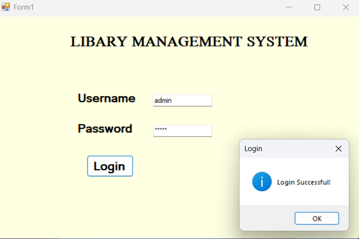
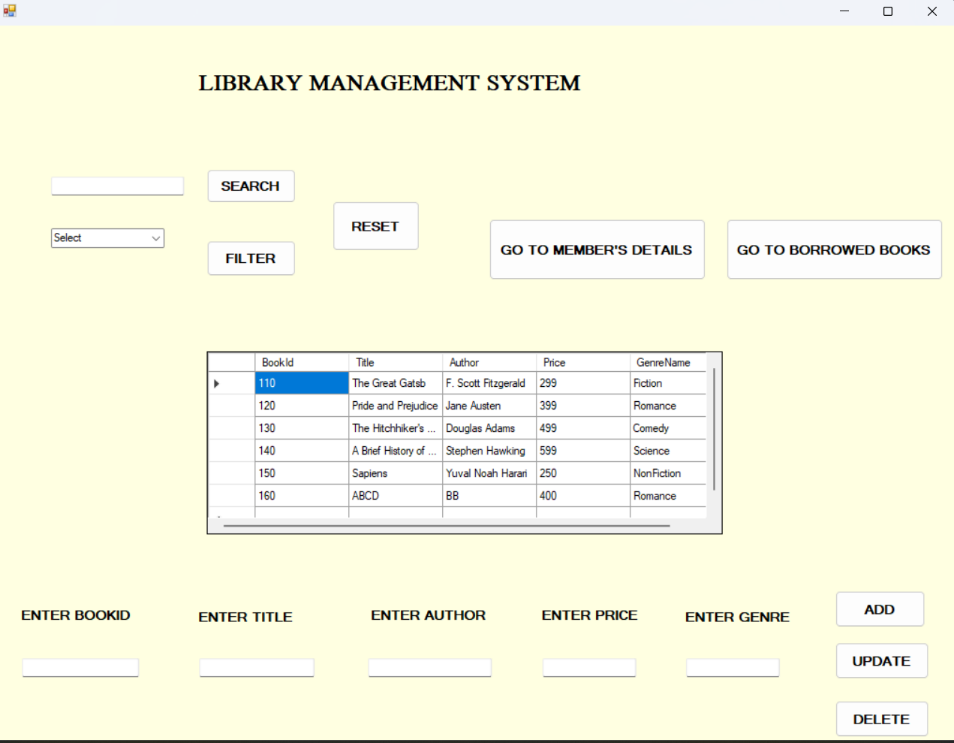
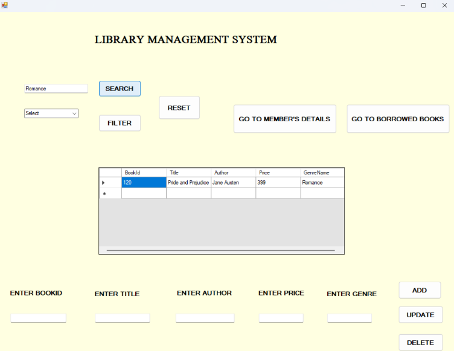
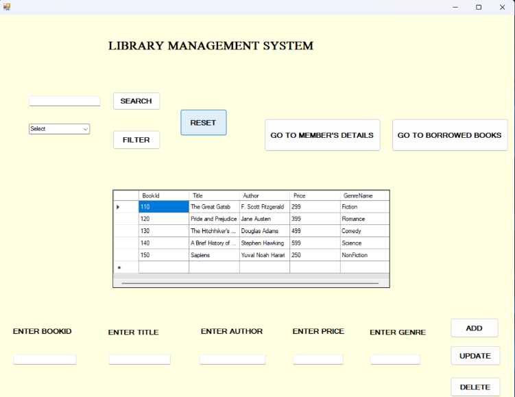
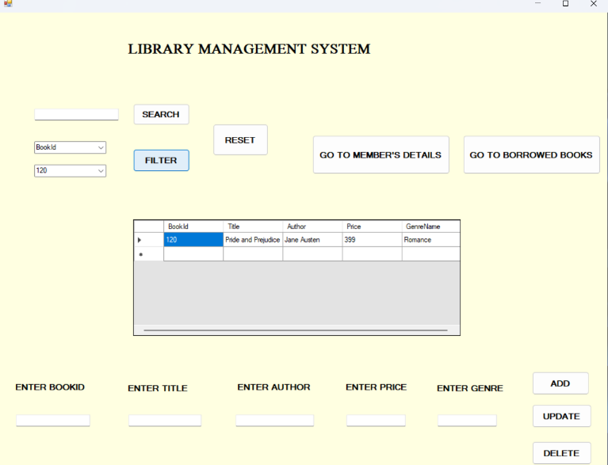
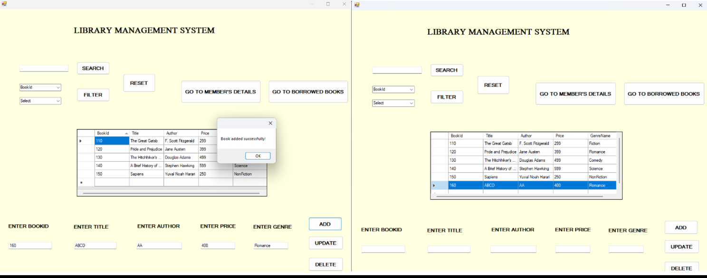
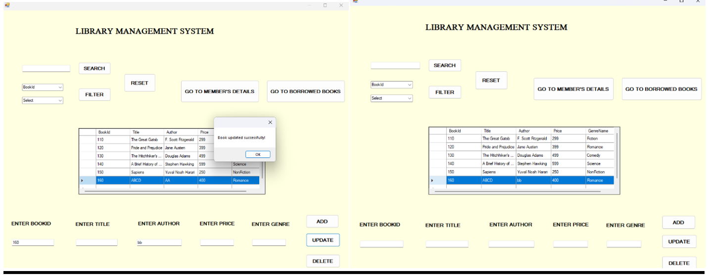
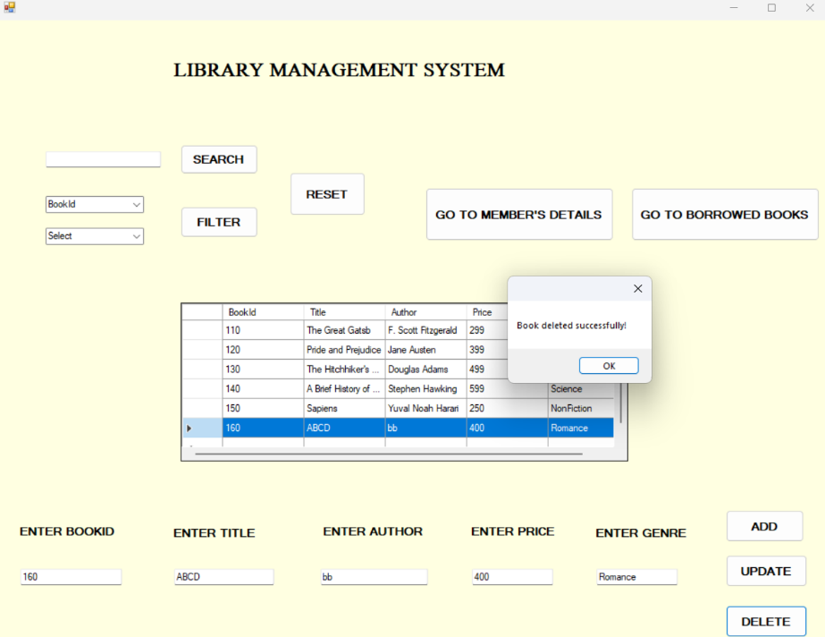
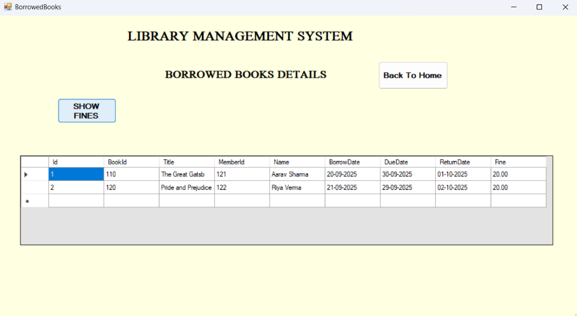

# Library-Management-System
A Windows desktop application built to manage a library's books, members and borrowing records.
It includes a login screen, a main library form to add, update, delete, search and filter books, a member listing and a borrowed-books viewver.
The system uses WinForms and MySQL database to cover key features such as authentication, book management, and tracking borrow/return details.

